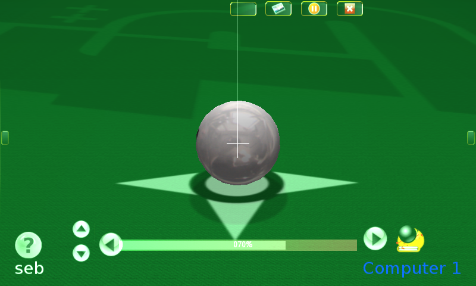

GL4ES - OpenGL for GLES Hardware
====

Many OpenGL software already works with GL4ES.

Complex OpenGL 1.5 games, like Foobillard++, that uses cascaded display list, line stipple, TexGen, works fine. Here running on the OpenPandora. It will work with both GLES1.1 and GLES2.0 backend. Most OpenGL 1.x games will runs. 

The limit is an hardware one: GLES1.1 and GLES2.0 hardware do not allow reading Depth buffer, so some games that use it (like AssultCube) for game play wont run. Some FPS are using it just for cosmetics (Lens flare), the they still run fine without, Like Serious Sam (both First and Second Encouter), here on the OpenPandora again.

More complex program, like Blender, can also run.

But also Minecraft, here on an ODroid in this old video.

On the OpenGL 2.0, side using GLES2.0 backend, OpenRA can run on the Pandora.

And OpenGL 2.x opens a lot of dors. Many commercial games run just fine on gl4es.

Here some FNA games, running on an ODroid XU4 (using method described [there](https://magazine.odroid.com/article/playing-modern-fna-games-on-the-odroid-platform/)). That video show just a few, and even more can be make to run.

And with [Box86](https://github.com/ptitSeb/box86), even more commercial games can run, like here NeverWinter Night on an ODroid XU4
